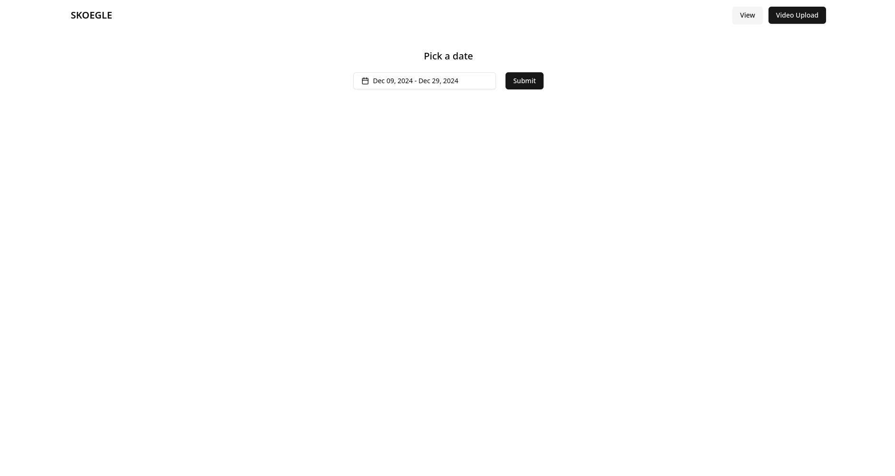
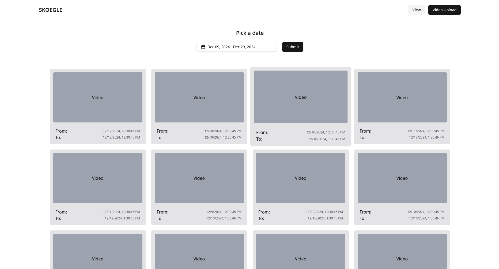
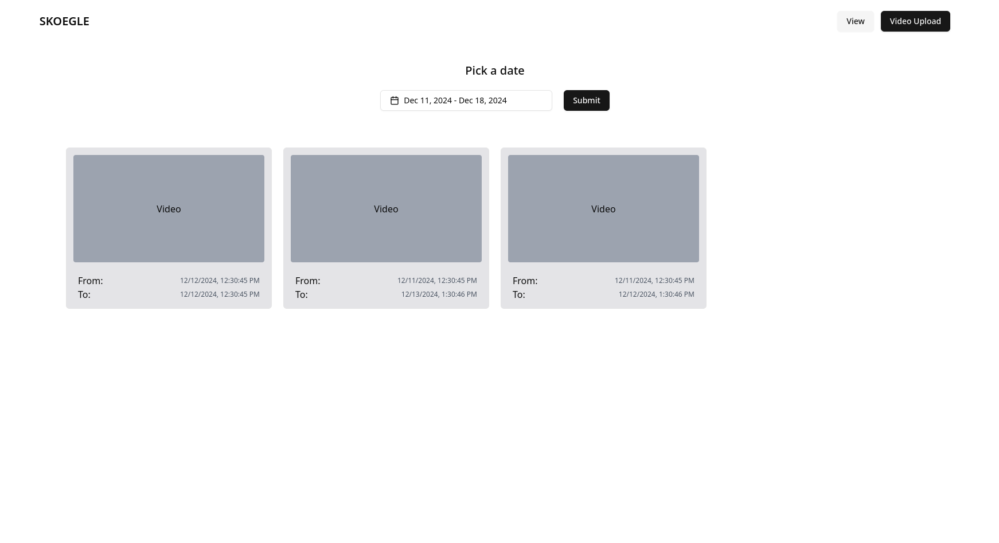
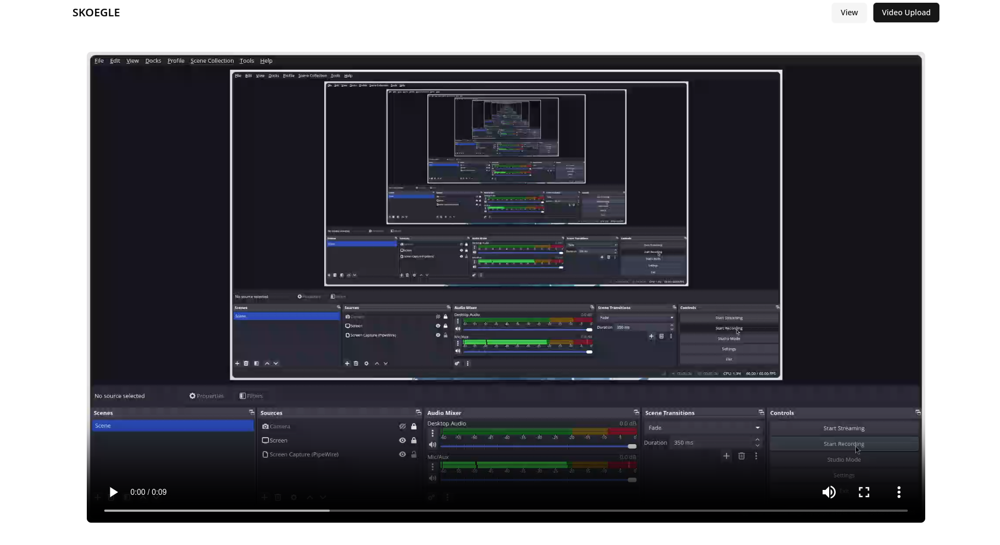
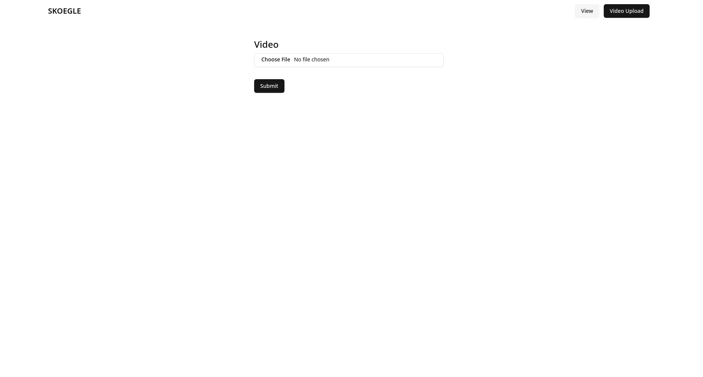
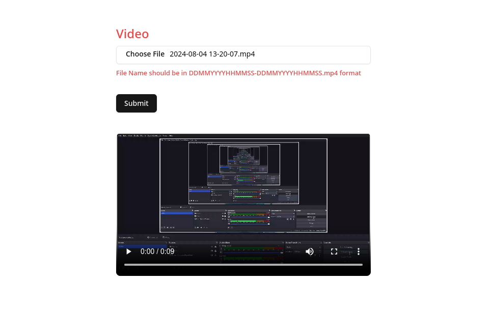
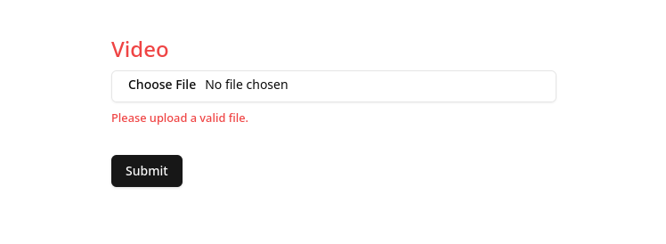
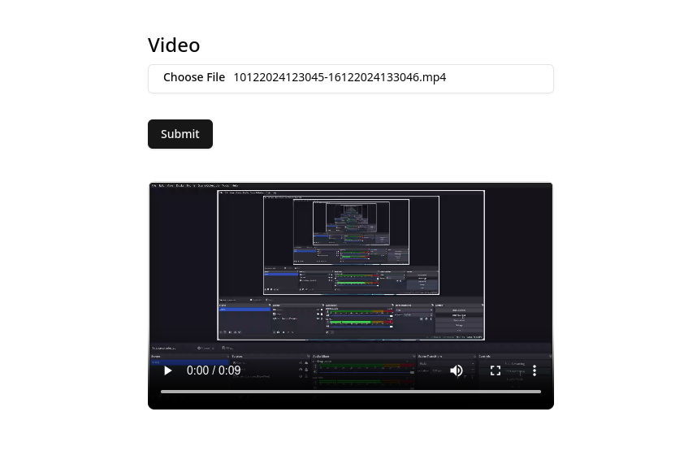
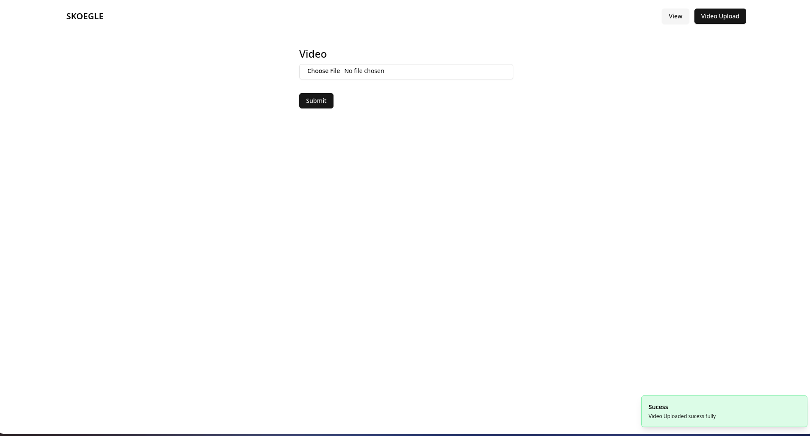

# SKOEGLE Assignment
### An assignment for to Video Management
- this assignment explore the `MERN` stack and `AWS s3` for file storage.
- build an web application that manage certain videos.
- In Home page on selected data range the video data will be shown. On clicking them navigate to new route and play the Video
- In Upload form web will be able to upload video. 
- Validating the video name to be in `DDMMYYYHHMMSS-DDMMYYYYHHMMSS.mp4` format and to be less than 100 MB.
- Then video will be stored in `AWS s3`.

## ScreenShots

### HomePage

### Video Play Page

### Upload Page

### FileFormated

### SucessFull 

